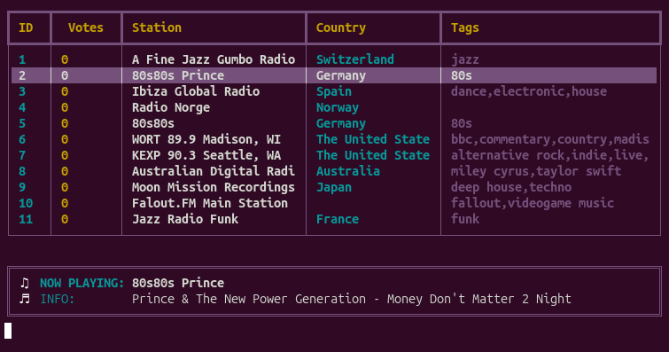

# radio.c 📻


A lightweight, terminal-based internet radio player written in C.



## Features

- **TUI Interface**: Clean, ncurses-style interface without the bloat.
- **Search**: Find stations by name, tag, or country.
- **Favorites**: Save your favorite stations for quick access.
- **Theming**: Includes multiple themes (Tokyo Night, Euro, Matrix, Cyberpunk).
- **Metadata**: Displays "Now Playing" information (Song Title/Artist).

## Installation

### Dependencies

You will need the following libraries installed on your system:

- `libvlc` (VLC backend)
- `libcurl` (API requests)
- `libreadline` (Input handling)
- `build-essential` (GCC, Make)

**Ubuntu/Debian:**
```bash
sudo apt update
sudo apt install libvlc-dev libcurl4-openssl-dev libreadline-dev build-essential
```

**Arch Linux:**
```bash
sudo pacman -S vlc curl readline base-devel
```

git clone https://github.com/El-Hondo/radioc.git
cd radioc
make

Run the application:

```bash
./radioc
```

### Controls

| Key | Action |
| :--- | :--- |
| `Use Arrows` | Navigate List |
| `Enter` | Play Selected Station |
| `s` or `Space` | Stop Playback |
| `+/-` | Volume Control |
| `f` | Find Station (by name) |
| `t` | Find by Tag (e.g., jazz, pop) |
| `c` | Find by Country Code (e.g., US, DE) |
| `l` | List Favorites |
| `a` | Add current station to Favorites |
| `d` | Delete from Favorites |
| `Shift + t` | Cycle Themes |
| `?` | Help |
| `q` | Quit |

## License

MIT License. See [LICENSE](LICENSE) for details.

## Roadmap 🗺️

- [ ] **Recording Support**: Save live radio streams to disk.
- [x] **Adaptive UI**: Automatically adjust border widths and layout based on terminal size.
- [ ] **Visualizer**: Simple Audio visualization in the terminal.
- [ ] **Packaging**: Create native packages (.deb, .rpm) for easier distribution.

## AI Transparency

This software was developed with the assistance of **Google Antigravity**. The project is as an experiment in AI-assisted coding, where architecture, debugging, and implementation were collaboratively developed.

